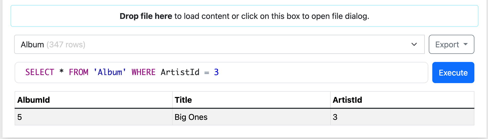

# SQLite AI Agent with PydanticAI 🐍




A Python-based SQLite AI agent that can understand natural language queries and convert them into SQL commands. This project demonstrates how to build an AI-powered database interface using PydanticAI.

## 🌟 Features

- Natural language to SQL query conversion
- SQLite database integration
- Type-safe query handling with Pydantic models
- AI-powered query understanding and validation
- Error handling and query safety checks

## 📋 Prerequisites

- Python 3.8+
- pip (Python package installer)

## 🛠️ Installation

1. Clone the repository:

```bash
git clone https://github.com/pakagronglb/sqlite-ai-agent.git
cd sqlite-ai-agent
```

2. Install required dependencies:

```bash
pip install -r requirements.txt
```

3. Set up your environment variables:
```bash
cp .env.example .env
# Edit .env with your API keys and configurations
```

## 🚀 Usage

```python
from sql_agent import SQLAgent

# Initialize the agent
agent = SQLAgent(database_path="your_database.db")

# Query using natural language
result = agent.query("Show me all users who joined in the last month")
```

## 📁 Project Structure

```
sqlite-ai-agent/
├── sql_agent.py      # Main agent implementation
├── sql.py           # SQL query handling
├── load_models.py   # AI model loading utilities
├── .env            # Environment variables
├── .gitignore      # Git ignore file
└── README.md       # Project documentation
```

## ⚙️ Configuration

Create a `.env` file with the following variables:
```
OPENAI_API_KEY=your_api_key_here
MODEL_NAME=gpt-3.5-turbo
```

## 🤝 Contributing

1. Fork the repository
2. Create your feature branch (`git checkout -b feature/AmazingFeature`)
3. Commit your changes (`git commit -m 'Add some AmazingFeature'`)
4. Push to the branch (`git push origin feature/AmazingFeature`)
5. Open a Pull Request

## 📝 License

This project is licensed under the MIT License - see the LICENSE file for details.

## 🙏 Acknowledgments

- Tutorial by [Jie Jenn](https://www.youtube.com/@jiejenn) - [Building Your Own SQLite AI Agent With PydanticAI](https://www.youtube.com/watch?v=OZcOE0IiWj0)
- PydanticAI community
- OpenAI for their API services

## ⚠️ Disclaimer

This project is for educational purposes only. Always ensure proper security measures when dealing with databases and API keys.

## 📧 Contact

Pakagrong Lebel - [pakagronglebel@gmail.com](mailto:pakagronglebel@gmail.com)

Project Link: [https://github.com/pakagronglb/sqlite-ai-agent](https://github.com/pakagronglb/sqlite-ai-agent)
